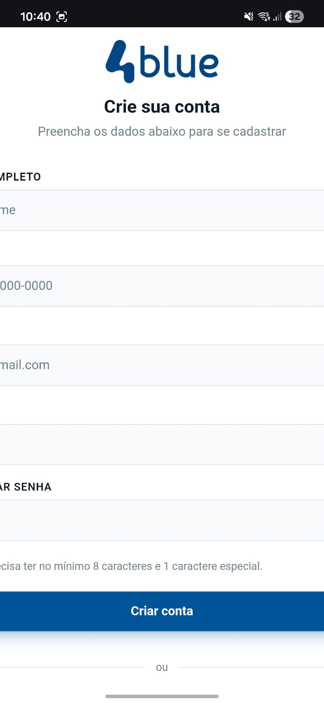
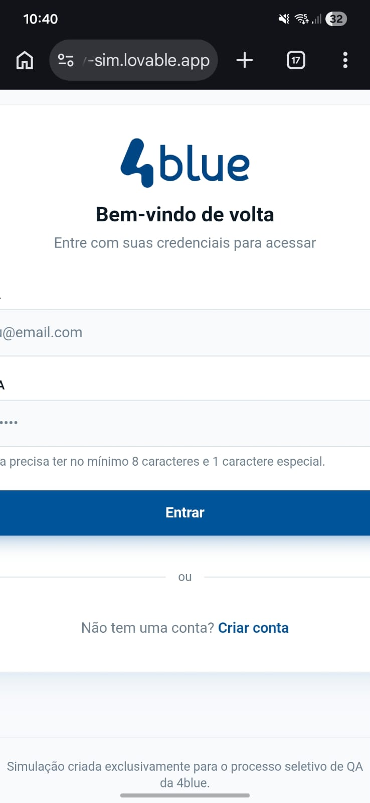
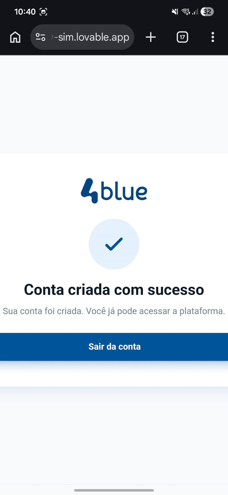

# Teste Técnico – QA Tester - Processo Seletivo 4blue

## 📋 Informações Gerais

**Candidato:** Jefferson França Santos  
**Data de Análise:** 05/03/2026  
**Sistema Testado:** https://qa-play-sim.lovable.app/  
**Objetivo:** Identificar bugs funcionais, inconsistências de UX e problemas de segurança básicos  
**Nabegador:** Microsoft Edge - 
**Versão:** 145.0.3800.82  
**Sistema Operacional:** Windows 11

## 🎯 Escopo da Análise

O microssistema avaliado contém as seguintes telas:
- ✅ Tela de Login
- ✅ Tela de Criação de Conta
- ✅ Tela de Sucesso

---

## 🐛 Bugs Identificados

### Bug #1

**Título:** Credenciais expostas no Session Storage

**Descrição:**  
As credenciais dos usuários (email e senha) estão sendo armazenadas em texto puro no Session Storage do navegador, permitindo que qualquer pessoa com acesso ao navegador visualize as credenciais de quem usou a máquina.

**Passos para Reproduzir:**

  <video width="640" height="300" controls>
    <source src="data/session-storage.mp4" type="video/mp4">
    Seu navegador não suporta a tag de vídeo.
  </video>

**Resultado Atual:**  
O sistema armazena todas as contas criadas no session storage com email e senha em texto puro, permitindo que sejam visualizadas diretamente por qualquer pessoa com acesso ao navegador.

**Resultado Esperado:**  
Informações sensíveis não devem ser armazenadas no session storage nem expostas no lado do usuário.

**Severidade:** `Crítico`  
**Prioridade:** `Alta`

---

### Bug #2

**Título:** Credencial do usuário exposta no terminal

**Descrição:**  
O sistema está expondo informações sensíveis (email e senha) no console do navegador durante os processos de login e criação de conta.

**Passos para Reproduzir:**

  <video width="640" height="300" controls>
    <source src="data/credenciais-expostas.mp4" type="video/mp4">
    Seu navegador não suporta a tag de vídeo.
  </video>

**Resultado Atual:**  
O sistema expõe as credenciais do usuário (email e senha) no console do navegador através de funções de debug não removidas do código, permitindo que sejam visualizadas por qualquer pessoa que abra o console.

**Resultado Esperado:**  
Todas as instruções de debug e logs contendo informações sensíveis devem ser removidas do código. O sistema não deve expor credenciais ou dados sensíveis em nenhum ponto acessível ao usuário final.

**Severidade:** `Crítico`  
**Prioridade:** `Alta`

---

### Bug #3

**Título:** Página de sucesso acessível sem autenticação

**Descrição:**  
A página de sucesso pode ser acessada diretamente através da URL, sem que o usuário passe pelo processo de login ou criação de conta. Isso permite que qualquer usuário acesse uma área que deveria ser exibida apenas após autenticação.

**Passos para Reproduzir:**

  <video width="640" height="300" controls>
    <source src="data/pagina-sucesso.mp4" type="video/mp4">
    Seu navegador não suporta a tag de vídeo.
  </video>

**Resultado Atual:**  
O sistema carrega a página de sucesso normalmente mesmo sem que o usuário tenha realizado login ou cadastro, permitindo acesso não autorizado.

**Resultado Esperado:**  
O sistema deve validar se o usuário está autenticado antes de permitir o acesso à página de sucesso.

**Severidade:** `Crítico`  
**Prioridade:** `Alta`

---

### Bug #4

**Título:** Sistema permite cadastro e login com dados vazios ou incompletos

**Descrição:**  
Os formulários de login e cadastro não possuem validação adequada dos dados inseridos, permitindo envio de formulários vazios ou incompletos.

**Passos para Reproduzir:**

  <video width="640" height="300" controls>
    <source src="data/campos-obrigatoriedade.mp4" type="video/mp4">
    Seu navegador não suporta a tag de vídeo.
  </video>

**Resultado Atual:**  
O sistema permite fazer login e criar conta sem validar se os campos foram preenchidos, processando requisições com dados vazios ou incompletos.

**Resultado Esperado:**  
O sistema deve marcar todos os campos como obrigatórios e impedir o envio dos formulários até que sejam preenchidos corretamente. No login: email e senha. No cadastro: nome, email, telefone e senha.

**Severidade:** `Crítico`  
**Prioridade:** `Alta`

---

### Bug #5

**Título:** Campo de email aceita formato inválido

**Descrição:**  
O campo de email permite inserir valores que não seguem o formato padrão de endereço de email.

**Passos para Reproduzir:**

  <video width="640" height="300" controls>
    <source src="data/campo-email.mp4" type="video/mp4">
    Seu navegador não suporta a tag de vídeo.
  </video>

**Resultado Atual:**  
O sistema aceita valores inválidos como email sem apresentar erro.

**Resultado Esperado:**  
O sistema deve validar o formato do email antes de permitir o cadastro.

**Severidade:** `Alto`  
**Prioridade:** `Alta`

---

### Bug #6

**Título:** Sistema não valida confirmação de senha

**Descrição:**  
O sistema não verifica se a senha inserida corresponde à confirmação de senha no momento do cadastro.

**Passos para Reproduzir:**

  <video width="640" height="300" controls>
    <source src="data/campo-senha.mp4" type="video/mp4">
    Seu navegador não suporta a tag de vídeo.
  </video>

**Resultado Atual:**  
O sistema permite continuar o cadastro mesmo com senhas diferentes.

**Resultado Esperado:**  
O sistema deve validar se as senhas são iguais antes de permitir o cadastro.

**Severidade:** `Alto`  
**Prioridade:** `Alta`

---

### Bug #7

**Título:** Sobreposição de campos no formulário de cadastro

**Descrição:**  
Os campos de telefone e confirmar senha estão sobrepostos aos campos anteriores (nome e senha respectivamente), causando problemas de visualização e impedindo o acesso ao ícone de mostrar/ocultar senha.

**Passos para Reproduzir:**

  <video width="640" height="300" controls>
    <source src="data/campos-sobrepostos.mp4" type="video/mp4">
    Seu navegador não suporta a tag de vídeo.
  </video>

**Resultado Atual:**  
O sistema exibe o campo de telefone sobreposto ao campo de nome e o campo de confirmar senha sobreposto ao campo de senha, escondendo inclusive o ícone de visualizar senha digitada.

**Resultado Esperado:**  
Todos os campos devem estar corretamente espaçados sem sobreposição, permitindo visualização e interação completa com todos os elementos.

**Severidade:** `Médio`  
**Prioridade:** `Alta`

---

### Bug #8

**Título:** Layout não responsivo na versão mobile

**Descrição:**  
O sistema não possui design responsivo para dispositivos móveis. Elementos da interface ultrapassam os limites da tela, causando corte de informações e scroll horizontal indesejado.

**Passos para Reproduzir:**
1. Acessar o sistema em um dispositivo mobile ou redimensionar o navegador para largura mobile
2. Navegar pelas telas do sistema
3. Observar elementos ultrapassando os limites da tela

  <table>
    <tr>
      <td></td>
      <td></td>
      <td></td>
    </tr>
  </table>

**Resultado Atual:**  
O sistema exibe elementos com largura fixa que ultrapassam o viewport mobile, causando corte de informações e scroll horizontal indesejado.

**Resultado Esperado:**  
Todas as telas devem se ajustar automaticamente à largura do dispositivo, mantendo o conteúdo visível e proporcionando experiência consistente em qualquer tamanho de tela.

**Severidade:** `Médio`  
**Prioridade:** `Médio`

---

### Bug #9

**Título:** Campo de telefone aceita caracteres não numéricos

**Descrição:**  
O campo de telefone permite a inserção de letras e outros caracteres não numéricos, sem realizar validação do formato esperado para números de telefone.

**Passos para Reproduzir:**

  <video width="640" height="300" controls>
    <source src="data/campo-telefone.mp4" type="video/mp4">
    Seu navegador não suporta a tag de vídeo.
  </video>

**Resultado Atual:**  
O sistema aceita letras no campo de telefone sem apresentar erro de validação.

**Resultado Esperado:**  
O campo de telefone deve aceitar apenas números e validar o formato do telefone.

**Severidade:** `Médio`  
**Prioridade:** `Média`

---

### Bug #10

**Título:** Sistema permite cadastro de múltiplas contas com dados idênticos

**Descrição:**  
O sistema permite criar várias contas utilizando exatamente os mesmos dados (email, nome, telefone e senha), sem realizar nenhuma verificação de duplicidade. Isso pode gerar inconsistência nos dados, dificultar a identificação única dos usuários e permitir cadastros fraudulentos.

**Passos para Reproduzir:**

  <video width="640" height="300" controls>
    <source src="data/contas-iguais.mp4" type="video/mp4">
    Seu navegador não suporta a tag de vídeo.
  </video>

**Resultado Atual:**  
O sistema permite criar múltiplas contas com todos os dados idênticos (email, nome, telefone e senha) sem apresentar nenhum erro ou aviso.

**Resultado Esperado:**  
O sistema deve verificar se já existe uma conta com os mesmos dados, especialmente o email que deve ser único, e impedir o cadastro de contas duplicadas exibindo uma mensagem de erro apropriada.

**Severidade:** `Médio`  
**Prioridade:** `Média`

---

### Bug #11

**Título:** Ícone de visualizar senha desaparece permanentemente após perder o foco

**Descrição:**  
No campo de confirmação de senha, o ícone para visualizar a senha (olho) aparece apenas na primeira vez que o usuário digita. Após o campo perder o foco, o ícone não reaparece mesmo quando o usuário retorna ao campo e digita novamente, impedindo que o usuário visualize sua senha nas tentativas subsequentes.

**Passos para Reproduzir:**

  <video width="640" height="300" controls>
    <source src="data/visualizar-senha.mp4" type="video/mp4">
    Seu navegador não suporta a tag de vídeo.
  </video>

**Resultado Atual:**  
O sistema remove o ícone de visualização da senha permanentemente após o campo perder o foco pela primeira vez, fazendo com que o ícone só reapareça caso o usuário apague completamente a senha e digite novamente desde o início.

**Resultado Esperado:**  
O ícone de visualização deve estar sempre disponível enquanto houver texto no campo, independentemente de quantas vezes o usuário entre e saia do campo.

**Severidade:** `Médio`  
**Prioridade:** `Média`

---

## 🔥 Priorização de Correções

### Quais 2 bugs você corrigiria primeiro e por quê?

#### 1º Bug a Corrigir: [Bug #1 - Credenciais expostas no Session Storage](#bug-1)

**Justificativa:**  
Escolhi esse bug como o mais crítico porque ele expõe diretamente as credenciais dos usuários. Qualquer pessoa que tenha acesso ao navegador pode abrir o DevTools e visualizar o email e a senha armazenados em texto puro no session storage.

Isso se torna ainda mais problemático em ambientes compartilhados, como computadores de trabalho ou máquinas utilizadas por mais de uma pessoa. Como os dados ficam visíveis até o navegador ser fechado, todos os usuários que utilizarem o sistema ficam expostos.

A correção também não parece ser complexa, já que bastaria remover esse armazenamento ou utilizar um mecanismo mais seguro de autenticação, como tokens.

#### 2º Bug a Corrigir: [Bug #2 - Credencial do usuário exposta no terminal](#bug-2)

**Justificativa:**  
Coloquei esse bug em segundo lugar porque ele também expõe informações sensíveis dos usuários, como email e senha, diretamente no console do navegador.

Mesmo sendo necessário abrir o DevTools para visualizar essas informações, ainda assim representa um risco de segurança. Isso pode acontecer, por exemplo, durante sessões de suporte técnico, gravações de tela ou apresentações do sistema.

Esse tipo de problema geralmente acontece quando logs de desenvolvimento (como console.log) acabam permanecendo no código.

Como a correção é simples, removendo esses logs do código, considero importante resolver esse problema rapidamente para evitar a exposição desnecessária de dados sensíveis.

---

## 💡 Sugestões de Melhorias

### Melhorias de UX/UI

1. **Clareza nos Textos Instrucionais**
   - **Descrição:** Textos como "Entre com suas credenciais para acessar" ficam incompletos. Sugiro alterar para "Entre com suas credenciais para acessar sua conta", tornando a mensagem mais clara e profissional.
   - **Benefício:** Melhora a comunicação e reduz dúvidas do usuário.
   - **Tela Afetada:** Login

2. **Reposicionar Mensagens de Validação do Email**
   - **Descrição:** A validação do email aparece apenas como tooltip ao passar o mouse, o que pode passar despercebido. Sugiro exibir mensagens de erro em vermelho abaixo do campo.
   - **Benefício:** Erros ficam mais visíveis, permitindo correção rápida e reduzindo frustração.
   - **Tela Afetada:** Criação de Conta

### Melhorias de Segurança

1. **Implementar Indicadores de Obrigatoriedade nos Campos**
   - **Descrição:** Adicionar asterisco vermelho (*) nos campos obrigatórios com legenda explicativa e validações em tempo real quando o usuário tentar prosseguir sem preencher os campos necessários.
   - **Justificativa:** Guia o usuário durante o preenchimento e garante coleta de dados essenciais para autenticação e recuperação de conta.

2. **Implementar Validação dos Requisitos de Senha**
   - **Descrição:** O sistema exibe requisitos de senha mas não valida se foram cumpridos. Usuários podem criar senhas fracas como "123". Sugiro implementar validação real com indicadores visuais (checks verde/vermelho) em tempo real.
   - **Justificativa:** Sem validação efetiva, o sistema fica vulnerável. Combinado com os Bugs #1 e #2 de exposição de credenciais, senhas fracas aumentam drasticamente o risco de comprometimento.

### Melhorias de Funcionalidade

1. **Adicionar Funcionalidade de "Esqueci Minha Senha"**
   - **Descrição:** Incluir link "Esqueci minha senha" na tela de login com fluxo de recuperação por email.
   - **Valor Agregado:** Funcionalidade essencial que evita bloqueio permanente de usuários.

---

## 📊 Resumo Executivo

| Métrica | Quantidade |
|---------|------------|
| Total de Bugs Identificados | 11 |
| Bugs Críticos | 4 |
| Bugs de Alta Severidade | 2 |
| Bugs de Média Severidade | 5 |
| Bugs de Baixa Severidade | 0 |
| Sugestões de Melhorias | 5 |

---

## 🛠️ Metodologia Utilizada

A análise foi conduzida utilizando as seguintes técnicas:
- [x] Testes Exploratórios
- [x] Testes de Usabilidade
- [x] Testes de Segurança Básicos
- [x] Análise de Boas Práticas de UX
- [x] Testes de Validação de Formulários
- [x] Testes de Fluxo do Usuário

---

## 👤 Sobre o Candidato

**Nome:** Jefferson França Santos 
**E-mail:** jefferson.frds@gmail.com  

---

**Data de Conclusão:** 06/03/2026 